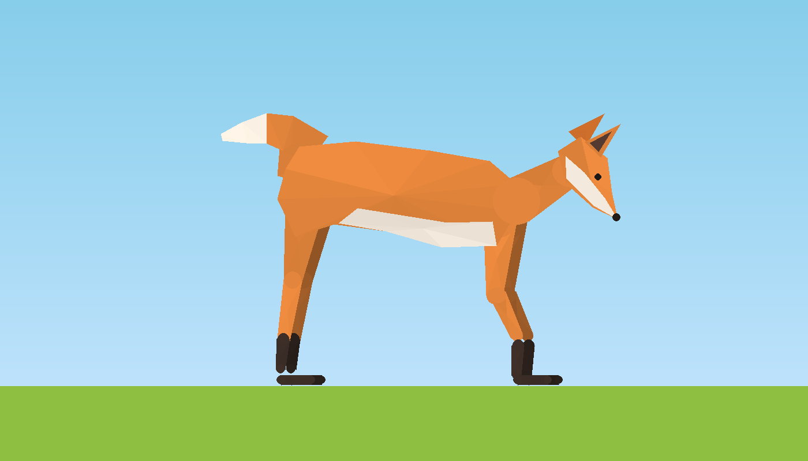
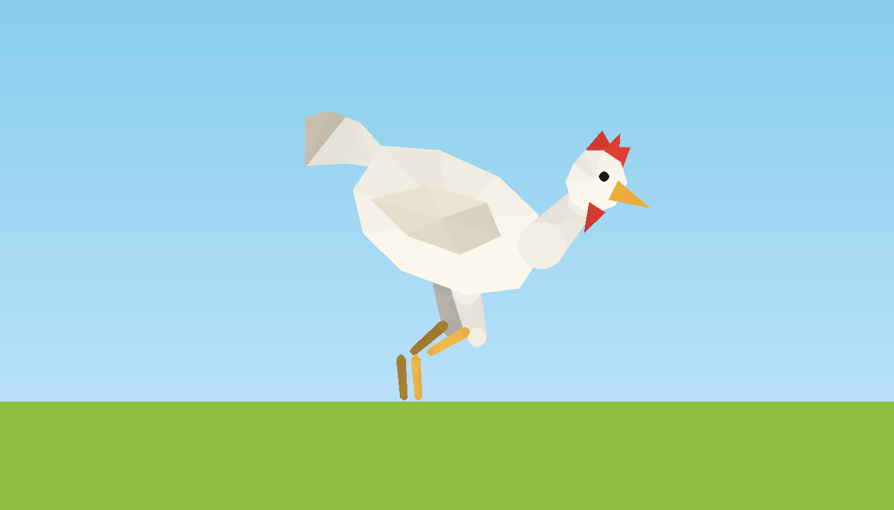
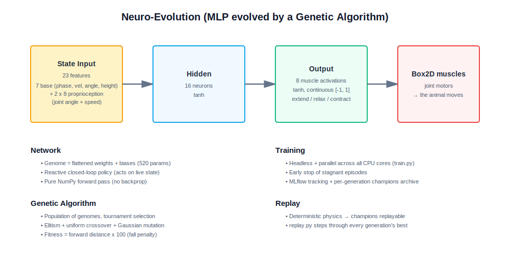
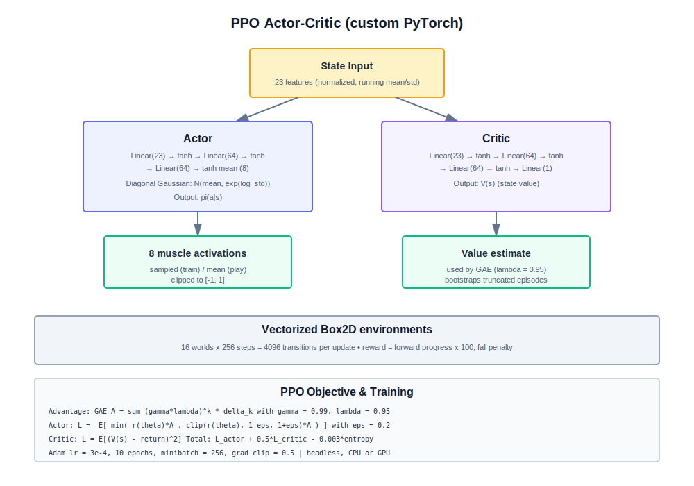

# 🦊 Quadruped AI


<p align="center">
  
</p>


## 📝 Project Description
This project is a playground to understand how to use **Box2D** with **Pygame**, and to teach animals how to walk from scratch. 🦊🐔

Each animal (a **fox** quadruped, a **chicken** biped) has real physics, muscles (joint motors), and a **fully procedural low-poly look drawn by code** (no more glued images). The body, legs, springy ears and whip-like tail are rendered directly from the Box2D bones, so adding a new animal is just a config file.

Two learning algorithms make them walk : a **neuro-evolution** (a small neural network evolved by a genetic algorithm) and a custom **PPO** (Proximal Policy Optimization) written in PyTorch. Everything can be trained **headless and in parallel** (locally or on Runpod), and analysed with **MLflow** and **Power BI**.

🚨 The project is not **finished** ! 🚨

---

## ⚙️ Features

Constructed :
  🦴 Real physics with muscles, interaction with the **box2D** library.

  🎨 **Procedural low-poly rendering** drawn from the bones (no glued textures), with visible facets to match the scenery.

  🐾 **Multiple animals** selectable in the config : a **fox** (quadruped) and a **chicken** (biped).

  🎏 **Procedural secondary animation** : spring-mounted ears and a simulated tail that whips with the motion.

  🧬 **Neuro-evolution** (genetic algorithm on the weights of an MLP, reactive closed-loop policy).

  🤖 **PPO** (custom PyTorch actor-critic, vectorized Box2D environments).

  ⚡ **Parallel headless training** on all CPU cores (`train.py`), with early stop of stagnant episodes.

  📊 **MLflow** experiment tracking + Power BI data analysis.

  🕺 An algorithm to select the best **choreography** (open loop).

Project for the futur :
  🐺 More animals (the design is config-driven).

  🧠 Other algorithms (NEAT, SAC...).

---

## Example Outputs

The fox and the chicken, both drawn **100% procedurally** from their Box2D skeleton :
<p align="center">
  
  
</p>

We can control an animal and the view (you can clearly see the parallax and the different modes, procedural / skeleton / overlay) :
<p align="center">
  
</p>

Here is the algorithm that selects the best choreography :
<p align="center">
  
</p>

### 📝 Notes & Observations
  🦊 The quadruped fox learns to walk much faster than the chicken (standing on two legs is hard, the biped falls a lot in early generations).

  🎨 The procedural skin holds up even in extreme poses (no seams tear apart, unlike the old glued images).

---

## ⚙️ How it works

  🎮 The animal lives in a **Box2D** world (bones + joint motors) rendered with **Pygame**.

  🧠 An IA reads the animal state (body position, velocity, angle, plus the angle and speed of each joint : proprioception) and outputs one continuous activation per muscle.

  🧬 The **neuro-GA** evolves a population of small networks : the best walkers reproduce (elitism, tournament selection, crossover, mutation).

  🤖 **PPO** instead uses gradients : it collects transitions from many parallel worlds and improves the policy with the clipped PPO objective and GAE.

  🎯 The reward (and the GA fitness) is simply the forward distance travelled, with a penalty when the animal falls.

  ⚡ For real training, `train.py` runs everything **without any window**, in parallel, which is roughly 250x faster than the on-screen loop.

  🕹️ `main.py` is then used to **watch** a trained policy walk, with the parallax scenery.

---

## 🗺️ Architecture Diagram

### Neuro-evolution (default, `IA_TYPE = "neuro_ga"`)

A tiny MLP whose weights are **evolved by a genetic algorithm** (no backpropagation) :



**Key details :**
- Input = 23 (7 base features + 2 x 8 proprioception)
- Hidden = 16 (tanh), Output = 8 muscle activations (tanh)
- Fitness = forward distance x 100 (fall penalty)

### PPO (`IA_TYPE = "ppo"`)

A custom PyTorch **actor-critic** trained with the clipped PPO objective :



**Training details :**
- γ (gamma) = 0.99, λ (lambda) = 0.95, clip_range = 0.2
- 16 vectorized Box2D envs x 256 steps per update
- Adam lr = 3e-4, entropy coef = 0.003, observation normalization

---

## 📂 Repository structure
```bash
├── assets/                       # Sprites, GIFs, procedural renders, SVG diagrams
│
├── src/
│   ├── config.py                 # Main switches : ANIMAL, IA_TYPE, display
│   │
│   ├── animals/                  # One file per animal (skeleton + procedural skin)
│   │   ├── definition.py         # Dataclasses (bones, muscles, skin spec)
│   │   ├── fox.py                # The fox (quadruped)
│   │   └── chicken.py            # The chicken (biped)
│   │
│   ├── core_engine/
│   │   ├── physics.py            # Box2D world, bones, muscles, Quadruped
│   │   ├── procedural_skin.py    # Procedural low-poly renderer
│   │   ├── overlay.py            # Display modes (procedural / skeleton / overlay)
│   │   ├── parallax.py           # Scrolling background
│   │   └── display.py            # Pygame camera & drawing
│   │
│   └── models/
│       ├── ia_base.py            # Common IA interface
│       ├── policy.py             # MLP + input building (shared, lightweight)
│       ├── ia_gen.py             # Neuro-evolution (genetic algorithm)
│       ├── ia_ppo.py             # PPO (custom PyTorch actor-critic)
│       ├── ia_chore.py           # Choreography selection
│       ├── evaluate.py           # Headless episode (used by parallel workers)
│       └── config_*.py           # Pydantic configs per algorithm
│
├── main.py                       # Watch / control an animal (windowed)
├── train.py                      # Headless parallel training (GA or PPO)
├── replay.py                     # Replay the GA champions
├── progress.py                   # Live progress of the current run
│
├── requirements.txt
├── RUNPOD.md                     # How to train on a Runpod CPU pod
├── LICENSE
└── README.md
```

---

## 💻 Run it on Your PC
Clone the repository and install dependencies:
```bash
git clone https://github.com/Thibault-GAREL/Quadruped-AI.git
cd Quadruped-AI

python -m venv .venv # if you don't have a virtual environment
source .venv/bin/activate   # Linux / macOS
.venv\Scripts\activate      # Windows

pip install pygame box2d-py numpy pandas mlflow pydantic pydantic-settings tqdm
# PyTorch is only needed for PPO (pick CPU or your CUDA version) :
pip install torch --index-url https://download.pytorch.org/whl/cpu

python main.py
```

Pick the animal and the algorithm in `src/config.py` :
```python
ANIMAL  = "fox"        # "fox" (quadruped) or "chicken" (biped)
IA_TYPE = "neuro_ga"   # "neuro_ga", "ppo" or "choreography"
```

### 🏋️ Train (headless & parallel, recommended)
```bash
python train.py --algo ga      # neuro-evolution on all CPU cores
python train.py --algo ppo     # PPO (needs PyTorch)
```
Both save checkpoints regularly and **resume automatically** if you relaunch them. See `RUNPOD.md` to run a long training on a **Runpod CPU pod** (this project is CPU-bound, no GPU needed).

### 👀 Watch a trained policy
```bash
python main.py       # uses IA_TYPE from src/config.py
python replay.py     # replay the GA champions, generation by generation
```

---

## 📊 Visualize results with MLflow

Launch the UI (from the project root, with a venv that has mlflow):
```powershell
mlflow ui --backend-store-uri sqlite:///mlflow.db
```
Open http://localhost:5000 in your browser.

**Find the best runs** :
1. Open experiment `quadruped-neuro-ga` (or `quadruped-ppo-fox`)
2. Add the `best_distance_ever` (or `ep_distance_mean` for PPO) metric column
3. Sort descending, the top row is your best run
4. Click any run to see the fitness curve over generations

**Best saved model file** is at:
```
outputs/models/<name>_run-XX_date-YYYY-MM-DD/best_model.pkl   # GA
outputs/models/<animal>_ppo.pt                                # PPO
```

Check progress of the latest run while it is training :
```powershell
python progress.py
```

---

## 📖 Inspiration / Sources
I code it without any help 😆 !

Code created by me 😎, Thibault GAREL - [Github](https://github.com/Thibault-GAREL)
