# 🦊 Quadruped AI


<p align="center">
  
</p>

## 📝 Project Description
This project is a playground to understand how to use **Box2D** with **Pygame**, and to teach animals how to walk from scratch. 🦊🐔🐈👽

Each animal (a **fox** quadruped, a **chicken** biped, a **cat** with four independent legs) has real physics, muscles (joint motors), and a **fully procedural low-poly look drawn by code** (no more glued images). The body, legs, springy ears and whip-like tail are rendered directly from the Box2D bones, so adding a new animal is just a config file.

The last creature, the **alien**, is not written by hand at all : its skeleton is encoded in its genes, so the same genetic algorithm evolves its **body and its brain together**. It is also the best walker of the project.

Two learning algorithms make them walk : a **neuro-evolution** (a small neural network evolved by a genetic algorithm) and a custom **PPO** (Proximal Policy Optimization) written in PyTorch. Everything can be trained **headless and in parallel** (locally or on Cloud), and analysed with **MLflow** and **Power BI**.

---

## ⚙️ Features

  🦴 Real physics with muscles, interaction with the **box2D** library.

  🎨 **Procedural low-poly rendering** drawn from the bones (no glued textures), with visible facets to match the scenery.

  🐾 **Multiple animals** selectable in the config : a **fox** (quadruped), a **chicken** (biped) and a **cat** (quadruped with an articulated spine).

  🐈 **Four independent legs** on the cat, where the fox moves its front pair and its back pair as one, so its network drives **17 muscles** instead of 8.

  👽 **Evolved skeleton** on the alien : 35 morphology genes ride at the front of the genome, so the GA chooses the number of legs (4, 6 or 8), the bone lengths and the joint limits at the same time as the network weights.

  🎏 **Procedural secondary animation** : spring-mounted ears and a simulated tail that whips with the motion.

  🧬 **Neuro-evolution** (genetic algorithm on the weights of an MLP, reactive closed-loop policy).

  🤖 **PPO** (custom PyTorch actor-critic, vectorized Box2D environments).

  ⚡ **Parallel headless training** on all CPU cores (`train.py`), with early stop of stagnant episodes.

  📊 **MLflow** experiment tracking + Power BI data analysis.

  🕺 An algorithm to select the best **choreography** (open loop).

  🦶 **Shaped reward** that penalises any ground contact outside the feet, so the animals walk instead of crawling.

---

## Example Outputs

The four creatures, all drawn **100% procedurally** from their Box2D skeleton :

<p align="center">
  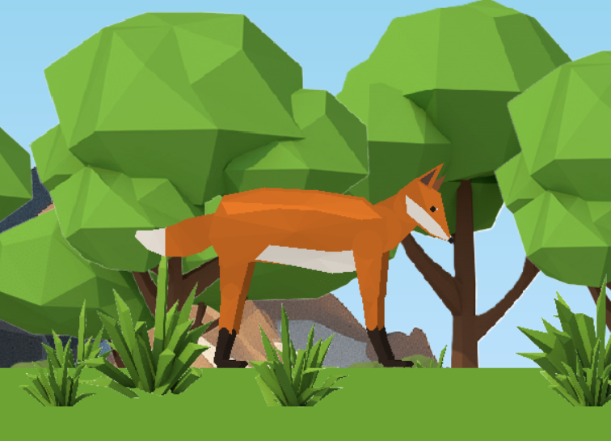
  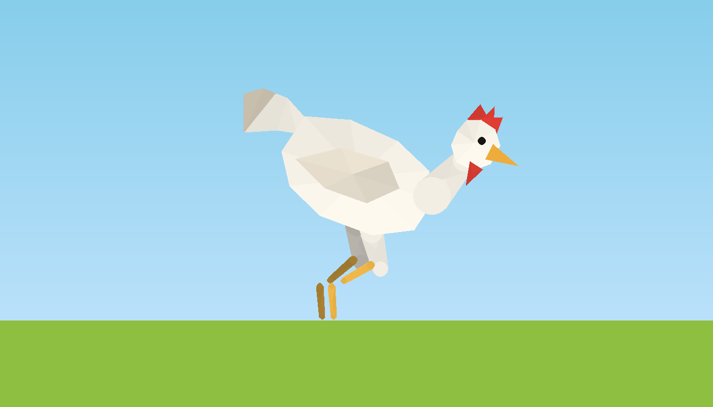
  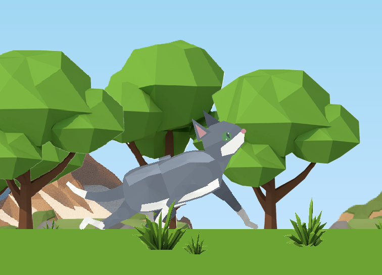
  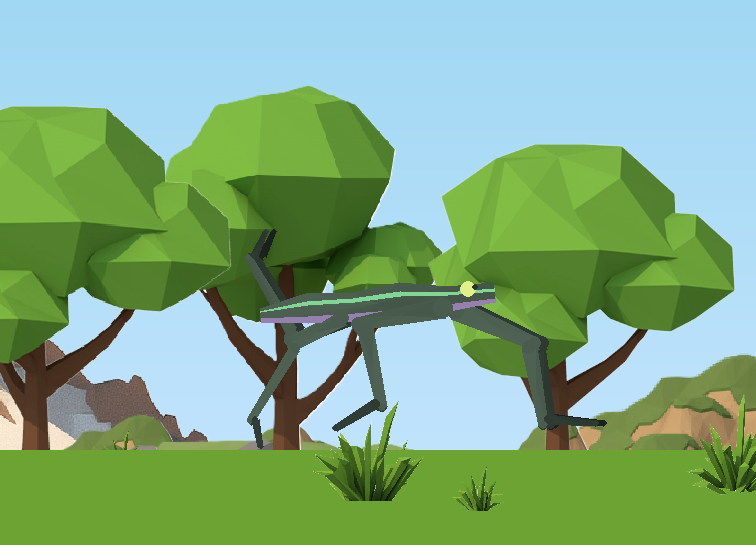
</p>

The cat and alien shots are frames of their trained champion, caught in the **first two seconds** of the episode. The alien body you see was **not designed**, it is the one its genes converged on : a long thin carapace on four tall legs.

We can control an animal and the view (you can clearly see the parallax and the different modes, procedural / skeleton / overlay) :

<p align="center">
  
</p>

Here is the algorithm that selects the best choreography :

<p align="center">
  
</p>

### 🏆 Trained walkers (neuro-evolution)

Here is the **best champion of the fox and of the chicken**, both trained from scratch (random weights, no prior knowledge) on a **32 vCPU Runpod CPU pod** with the exact same budget : 500 generations of 128 individuals, so 64 000 episodes per run. The cat arrived after the shaped reward, so it lives in its own section further down.

#### Genetic Algorithm :

The **fox** converges on a genuine four-legged gait, keeps its back roughly horizontal and covers **105 m** before the episode ends. The **chicken** has a much harder job (two legs, a high center of mass, and a body that wants to tip forward), so it settles on a fast hopping gait and reaches **41 m**. The biped also needs an extra **stability reward** in its fitness, otherwise the population converges on animals that fall immediately.

##### 🦊 Fox, 105 m

<p align="center">
  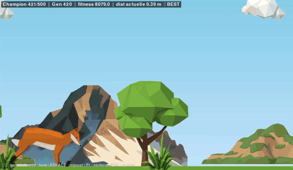
</p>
<p align="center">
  <i>The fox walks <b>105 m</b>.</i>
</p>

```bash
# set ANIMAL = "fox" in src/config.py, then :
python replay.py outputs/results/neuro-ga_run-22_date-2026-07-31
```

<details>
<summary>📈 Training curves</summary>

<picture>
  <source media="(prefers-color-scheme: dark)" srcset="assets/curves-ga-fox-dark.png">
  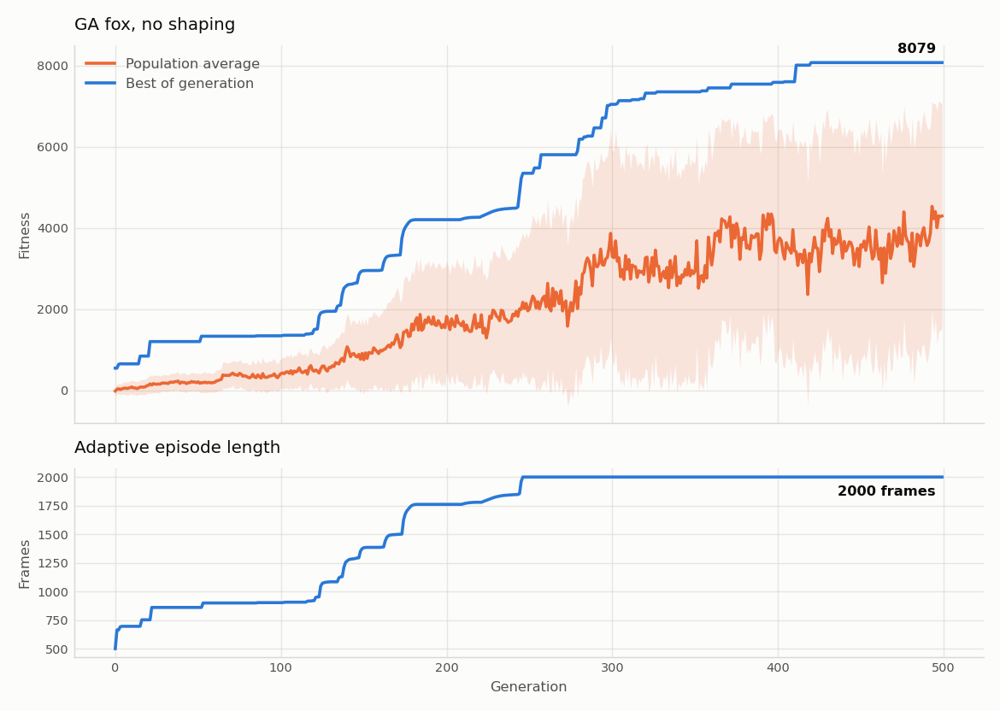
</picture>

The best individual climbs in **steps**, which is how a genetic algorithm looks from the inside : nothing improves for dozens of generations, then one lucky mutation raises the bar for everyone. The orange band is the population spread (one standard deviation), and it stays wide to the very end, mutation keeps producing bad walkers even once the elite is good.

The bottom panel explains the acceleration around generation 250 : the episode length is tied to the best fitness, so the fox unlocks the full **2000 frames** and gets the room to run further.

</details>

##### 🐔 Chicken, 41 m

<p align="center">
  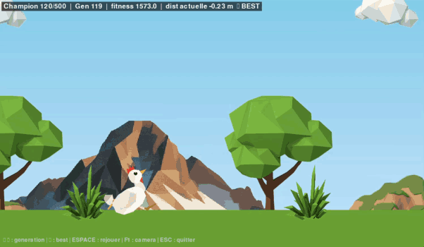
</p>
<p align="center">
  <i>The chicken <b>41 m</b>.</i>
</p>

```bash
# set ANIMAL = "chicken" in src/config.py, then :
python replay.py outputs/results/neuro-ga-chicken_run-18_date-2026-07-31
```

<details>
<summary>📈 Training curves</summary>

<picture>
  <source media="(prefers-color-scheme: dark)" srcset="assets/curves-ga-chicken-dark.png">
  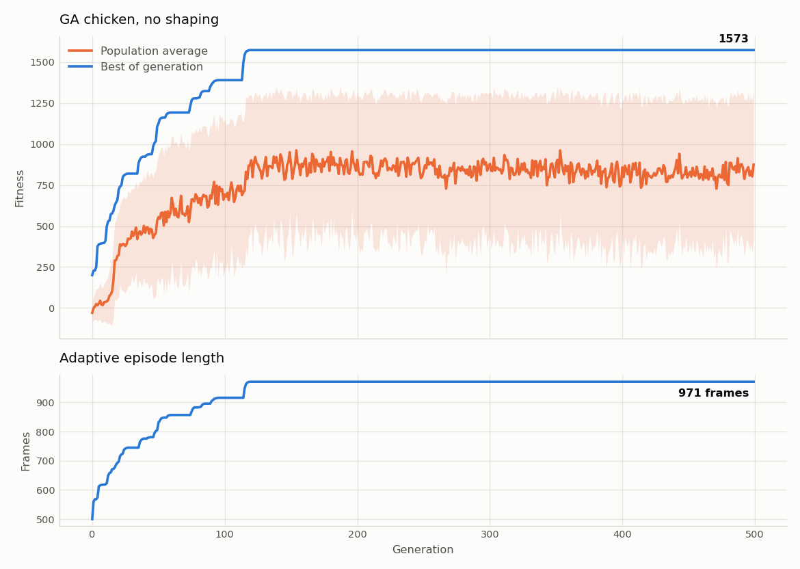
</picture>

Compare this to the fox above : the chicken **flatlines**. Its best fitness is reached around generation 119 and never moves again for the remaining 381 generations.

The bottom panel shows why, and it is mechanical rather than a lack of talent. Episode length grows with the best fitness, so a low score buys a short episode, a short episode caps the distance, and a capped distance caps the score. The chicken stays stuck at **971 frames** out of the 2000 the fox enjoys. This is exactly the trap the shaped reward breaks further down the page.

</details>

#### PPO :

Same task, same animals, but the policy is learned by **gradient descent** instead of evolution. PPO worked on a much smaller simulation budget here, **2 million physics steps** against 60 to 90 million for the GA (see the comparison table below).

##### 🦊 Fox, 22.8 m

<p align="center">
  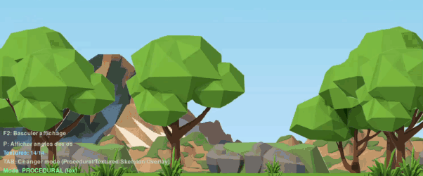
</p>
<p align="center">
  <i>The fox walks <b>22.8 m</b>.</i>
</p>

```bash
# set ANIMAL = "fox" in src/config.py, then :
python replay.py outputs/models/ppo-fox_run-02_date-2026-08-02
```

##### 🐔 Chicken, 10.7 m

<p align="center">
  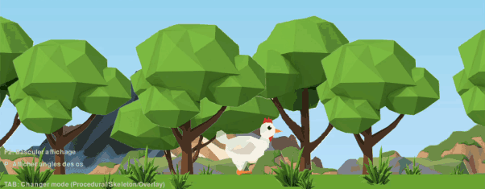
</p>
<p align="center">
  <i>The chicken <b>10.7 m</b>.</i>
</p>

```bash
# set ANIMAL = "chicken" in src/config.py, then :
python replay.py outputs/models/ppo-chicken_run-01_date-2026-08-02
```

---

### 🦶 Same runs, with the shaped reward

`SHAPED_REWARD = True` penalises any contact between the ground and something other than the feet, so the fox can no longer walk on its knees and the chicken can no longer drag its chest along the floor. Both learn a cleaner gait, and the trade is visible below. The **cat** was added after this switch, so it has only ever been trained with it.

#### Genetic Algorithm, with shaped reward :

##### 🦊 Fox, 76 m

<p align="center">
  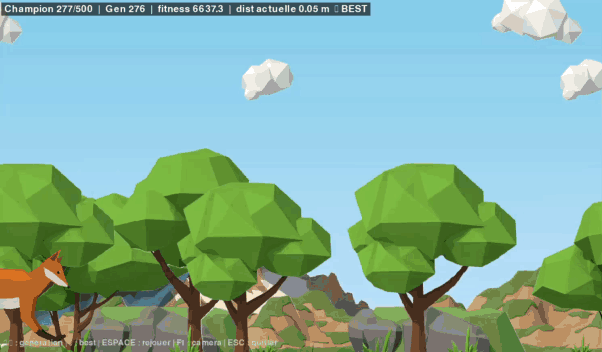
</p>
<p align="center">
  <i>The fox walks <b>76 m</b>, now on its feet.</i>
</p>

```bash
# set ANIMAL = "fox" in src/config.py, then :
python replay.py outputs/results/neuro-ga_run-23_date-2026-08-03
```

<details>
<summary>📈 Training curves</summary>

<picture>
  <source media="(prefers-color-scheme: dark)" srcset="assets/curves-ga-fox-shaped-dark.png">
  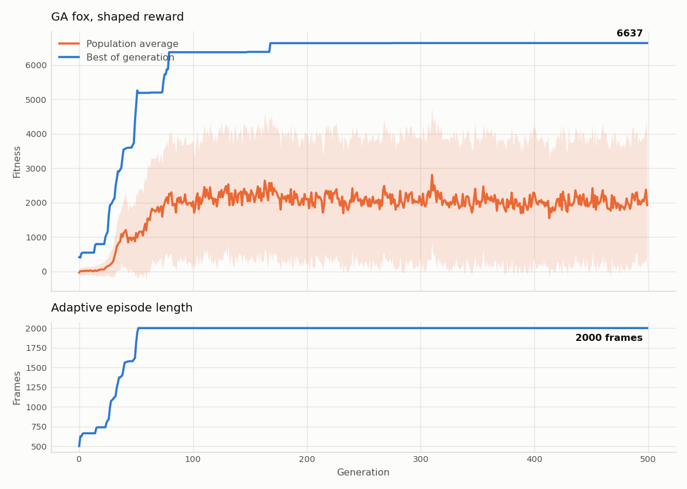
</picture>

Same staircase as the unshaped fox, simply graded on a stricter scale : every frame spent on a knee scales the distance gain down, so the curve tops out at 6637 instead of 8079. The shape of the learning is unchanged, which is the point, the penalty redirects the search without breaking it.

The fox still unlocks the full **2000 frames**, so it never falls into the chicken's trap.

</details>

##### 🐔 Chicken, 19 m

<p align="center">
  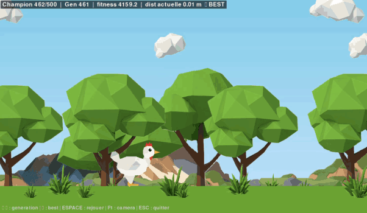
</p>
<p align="center">
  <i>The chicken <b>19 m</b>, shorter than without shaping but no longer dragging its chest.</i>
</p>

```bash
# set ANIMAL = "chicken" in src/config.py, then :
python replay.py outputs/results/neuro-ga-chicken_run-19_date-2026-08-03
```

<details>
<summary>📈 Training curves</summary>

<picture>
  <source media="(prefers-color-scheme: dark)" srcset="assets/curves-ga-chicken-shaped-dark.png">
  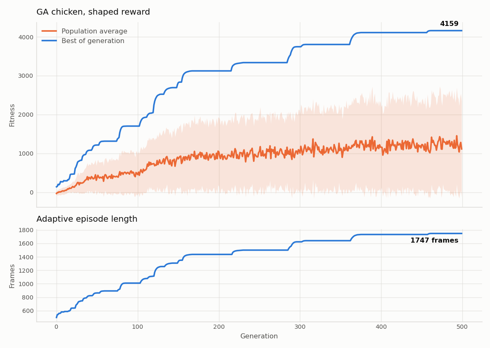
</picture>

This is the most interesting chart of the project. Put it next to the unshaped chicken above : the flat line is gone, the fitness keeps climbing all the way to generation 500 and reaches **4159** instead of stalling at 1573.

The bottom panel holds the explanation. Forbidden from dragging its chest, the chicken had to find a real gait, that gait scores higher, and the higher score buys longer episodes : **1747 frames** against 971 without shaping. The vicious circle became a virtuous one, and it was triggered by a constraint rather than by more training.

</details>

##### 🐈 Cat, 15.2 m

<p align="center">
  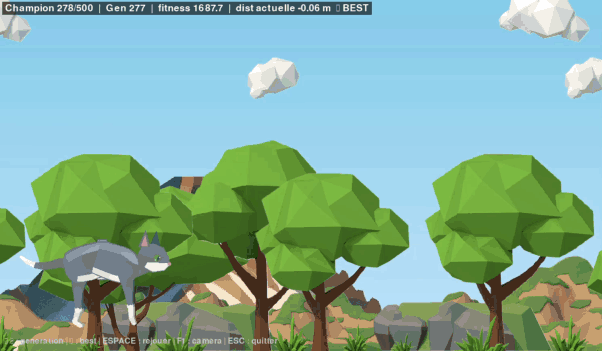
</p>
<p align="center">
  <i>The cat walks <b>15.2 m</b>, back level, with its four legs moving independently.</i>
</p>

```bash
# set ANIMAL = "cat" in src/config.py, then :
python replay.py outputs/results/neuro-ga-cat_run-02_date-2026-08-03
```

The cat is by far the **hardest body of the three**. Its trunk is cut in two bones joined by a spine muscle, and its four legs are driven separately, so the network controls **17 muscles** where the fox controls 8. The search space explodes (a genome of **961 weights** against 520 for the fox) and the two sides of the body can now trip over each other, which the fox simply cannot do.

<details>
<summary>📈 Training curves</summary>

<picture>
  <source media="(prefers-color-scheme: dark)" srcset="assets/curves-ga-cat-shaped-dark.png">
  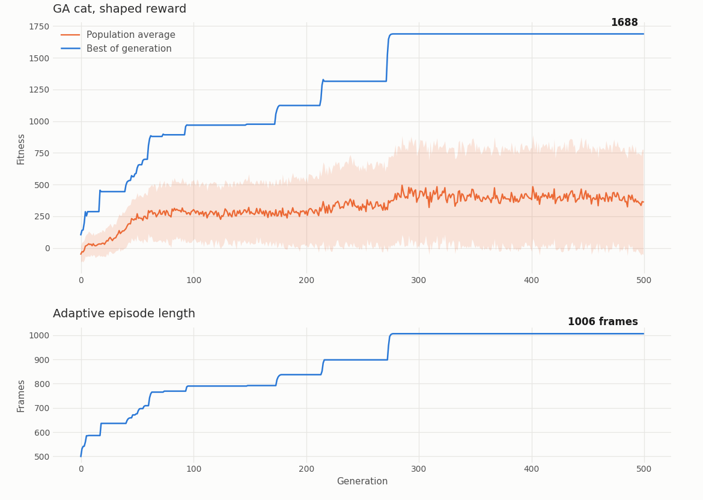
</picture>

The staircase is back, but the **timing is the opposite of the fox**. The fox reached 95 % of its final fitness at generation 79 and spent the 400 remaining generations nibbling. The cat only gets there at generation **273**, and its last real climb (1525 to 1688) happens in the final handful of improving generations. Coordinating four legs takes much longer to find, and the run ends while the animal is still getting better, so this one deserves a longer budget than 500 generations.

The bottom panel shows the cost of that difficulty. The cat never gets past **1006 frames**, roughly half of the fox's 2000, so it is judged on a much shorter window. Its fitness of 1688 is therefore not comparable to the fox's 6637, the two animals are not even running the same length of episode.

</details>

#### PPO, with shaped reward :

##### 🦊 Fox, 74 m

<p align="center">
  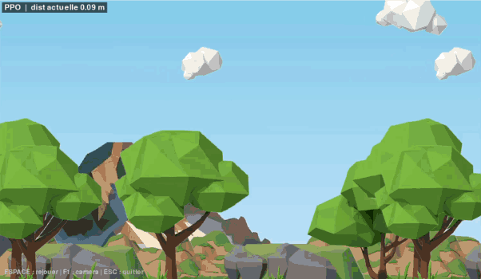
</p>
<p align="center">
  <i>The fox walks <b>74 m</b>, more than three times its unshaped run.</i>
</p>

```bash
# set ANIMAL = "fox" in src/config.py, then :
python replay.py outputs/models/ppo-fox_run-03_date-2026-08-03/last_model.pt
```

##### 🐔 Chicken, 93 m

<p align="center">
  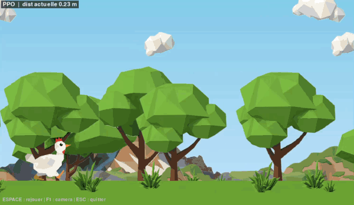
</p>
<p align="center">
  <i>The chicken <b>93 m</b>, the best walker of the whole project.</i>
</p>

```bash
# set ANIMAL = "chicken" in src/config.py, then :
python replay.py outputs/models/ppo-chicken_run-02_date-2026-08-03/last_model.pt
```

##### 🐈 Cat, 15.8 m

<p align="center">
  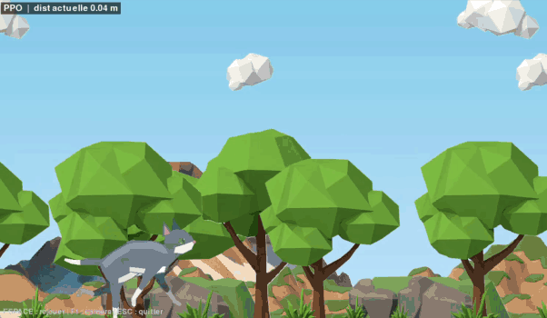
</p>
<p align="center">
  <i>The cat covers <b>15.8 m</b> nose down and rump in the air, pushing rather than walking.</i>
</p>

```bash
# set ANIMAL = "cat" in src/config.py, then :
python replay.py outputs/models/ppo-cat_run-02_date-2026-08-03/best_model.pt
```

The two algorithms land within half a metre of each other (15.8 m for PPO, 15.2 m for the GA), just as they did on the fox (74 m against 76 m). **The gait is not the same at all though.** The GA cat keeps its back level and walks on its four legs, PPO found a cheaper trick and shoves itself forward nose down. The numbers say it too : its `ep_bad_contact_rate` sits at **37 %** against 23 % for the shaped fox and 26 % for the shaped chicken, so the penalty made the cheating expensive without making it impossible.

⚠️ The fox and chicken commands point at **`last_model.pt`**, the cat command points at **`best_model.pt`**, and that is not a typo. The "best" checkpoint is the one that scored highest on the 1000 frame episodes used during training, which says nothing about holding a gait for 3000 frames. Which of the two wins depends entirely on the animal, so **try both** : on the chicken `last_model.pt` walks 93 m where `best_model.pt` falls after 8 m, on the cat it is the exact opposite (15.8 m against 6.8 m).

---

### 👽 Evolving the body itself

Every animal above was drawn by hand : I chose how many legs it had, how long each bone was, where each joint could travel. The GA only ever tuned the brain. The **alien** removes that ceiling. Its skeleton is built from **genes**, and those genes sit at the front of the very same genome as the network weights, so **one genetic algorithm evolves the body and the brain together** (the idea comes from Karl Sims' evolved virtual creatures).

  🧬 **35 morphology genes** decide the number of leg pairs (2 to 4, so **4, 6 or 8 legs**), the length and thickness of the body, the three segment lengths of each leg, their attachment point, their tilt and their joint limits.

  🔒 **The genome keeps a fixed length**, which is what makes crossover meaningful. The network is sized for the **maximum** of 24 muscles, a creature with fewer simply leaves the top outputs unused, active leg pairs always come first so a muscle index never shifts, and a leg keeps its 3 segments but can atrophy one to nothing.

  📐 So the network is **55 → 16 → 24** and the full genome is **1339 numbers** (35 of body, 1304 of brain), the biggest of the project.

##### 👽 Alien, 109 m

<p align="center">
  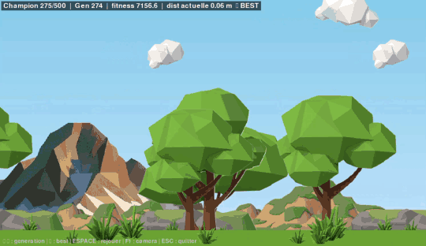
</p>
<p align="center">
  <i>The evolved creature covers <b>109 m</b>, the longest run of the whole project.</i>
</p>

```bash
# set ANIMAL = "alien" in src/config.py, then :
python replay.py outputs/results/neuro-ga-alien_run-03_date-2026-08-05
```

**Evolution threw legs away.** Random creatures come out with 4, 6 or 8 legs (about 40 %, 20 % and 40 % of them), and both runs converged on **4 legs** within 14 generations, then never reconsidered. The champion uses **12 of its 24 available muscles** and leaves the other 12 dead. Having more legs was allowed, cheap to keep, and still lost : extra legs are extra things to trip over, and extra outputs to coordinate.

Those 109 m are measured over the **3000 frame replay window**, and the creature finally tips over at frame 2900. Over the 2000 frames it was actually trained on it covers **78.13 m**, which is the number in the commit that produced it.

<details>
<summary>📈 Training curves</summary>

<picture>
  <source media="(prefers-color-scheme: dark)" srcset="assets/curves-ga-alien-dark.png">
  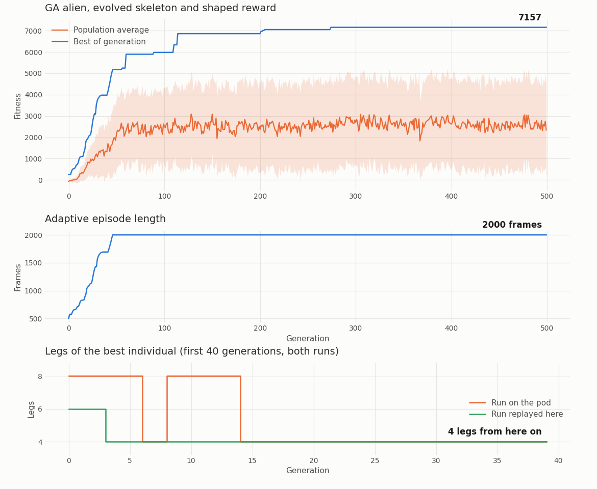
</picture>

The fitness reaches 95 % of its final value by generation 114, and the episode unlocks its full **2000 frames** at generation 46, sooner than any other animal of the project (52 for the shaped fox, 246 for the plain one). Evolving the body is not a handicap, it is a shortcut : instead of learning to walk with the legs it was given, the alien grows legs that suit the gait it is finding.

The bottom panel is the one that matters, and it holds **two runs at once**. The pod run started from an 8 legged champion and flipped between 8 and 4 until generation 14. The run replayed here started from 6 and settled on 4 by generation 3. Two independent searches, same verdict.

</details>

⚠️ **The champion from the pod run does not replay here**, it falls after 6.19 m. It was trained before the spawn height was fixed, when creatures were born about 0.58 m too high and spent their first frames in free fall. A hard landing is the worst possible start for a chaotic system, two machines diverge from the first impact. The fix (`spawn_y = longest * 0.85 + 0.14`, measured on 30 random creatures) makes the birth clean, and the run above was retrained locally on the corrected code so that what you replay is exactly what was evolved. That cost 1 h 15 on my own machine against 28 min 40 s on the pod, and it is the price of an honest GIF.

---

### 📊 Training runs comparison

Every trained model is logged here, so any new algorithm can be compared to the previous ones on the very same task :

| Algorithm | Animal | Network | Training budget | Best fitness | Distance | Gain vs gen 0 | Compute time |
|---|---|---|---|---|---|---|---|
| **Neuro-GA** | 🦊 Fox | 23 → 16 → 8 | 500 gen x 128 | **8079** | **105 m** | x14.8 | 3 min 41 s |
| **Neuro-GA** | 🐔 Chicken | 19 → 16 → 6 | 500 gen x 128 | **1573** | **41 m** | x7.8 | 5 min 48 s |
| **PPO** | 🦊 Fox | 23 → 64 → 8 | 500 updates (2M steps) | n/a | **22.8 m** | n/a | 7 min 16 s |
| **PPO** | 🐔 Chicken | 19 → 64 → 6 | 500 updates (2M steps) | n/a | **10.7 m** | n/a | 6 min 26 s |
| **Neuro-GA** + shaped | 🦊 Fox | 23 → 16 → 8 | 500 gen x 128 | **6637** | **76 m** | x16.0 | 17 min 32 s |
| **Neuro-GA** + shaped | 🐔 Chicken | 19 → 16 → 6 | 500 gen x 128 | **4159** | **19 m** | x29.7 | 9 min 15 s |
| **PPO** + shaped | 🦊 Fox | 23 → 64 → 8 | 500 updates (2M steps) | n/a | **74 m** | n/a | 5 min 44 s |
| **PPO** + shaped | 🐔 Chicken | 19 → 64 → 6 | 500 updates (2M steps) | n/a | **93 m** | n/a | 4 min 59 s |
| **Neuro-GA** + shaped | 🐈 Cat | 41 → 16 → 17 | 500 gen x 128 | **1688** | **15.2 m** | x16.0 | 13 min 4 s |
| **PPO** + shaped | 🐈 Cat | 41 → 64 → 17 | 500 updates (2M steps) | n/a | **15.8 m** | n/a | 8 min 7 s |
| **Neuro-GA** + shaped + evolved body | 👽 Alien | 55 → 16 → 24 | 500 gen x 128 | **7157** | **109 m** | x28.8 | 1 h 15 (local) |

The first two GA rows share the same hardware (a 32 vCPU pod), the same episode budget and the same fitness definition, which makes them directly comparable. Every **+ shaped** row ran on the same 8 vCPU pod instead, so the compute times of that block compare with each other but not with the two rows above. The alien row is the odd one out, it was retrained on my own machine (a 16 thread laptop CPU) to make the replay exact, so its 1 h 15 compares to nothing in this table.

**Gain vs gen 0** is the ratio between the final best fitness and the best fitness of the very first random generation, so it measures what the algorithm actually learned (and not how good the lucky starting population was).

⚠️ **The GA and PPO rows are not a fair fight**, and the gap has little to do with the algorithms themselves :

  🔢 **Simulation budget** : each GA run burned 64 000 episodes of roughly 1000 to 2000 frames, so **60 to 90 million physics steps**. Each PPO run saw **2 million steps**, which is 30 to 45 times less. PPO is simply far from convergence.

  ⏱️ **Episode length** : PPO caps episodes at 1000 frames (`MAX_EPISODE_FRAMES`), the GA lets them grow up to 2000, so the raw distances are not measured over the same window.

  🎯 **Objective** : the GA maximises a fitness (distance x 100, fall penalty, plus a stability bonus for the biped), PPO maximises a discounted per-step reward. The **Distance** column is the only quantity that means the same thing in both worlds.

The honest conclusion for now is that **neuro-evolution reaches a good gait far more cheaply on this task**, and that PPO deserves a much longer run (20M to 50M steps) before any real verdict.

The **+ shaped** rows use `SHAPED_REWARD = True`, which penalises any contact between the ground and something other than the feet. Two things stand out :

  🐔 **The chicken is transformed** : it now walks **93 m** in PPO, the longest PPO run of the project, fox included. Being a biped, it was the one cheating hardest, dragging its chest instead of walking, and forcing it onto its feet unlocked a real gait. Its GA fitness follows the same trend (1573 to **4159**), and the adaptive episode length went from 971 to **1747 frames**.

  🦊 **The fox gains too** : **74 m** in PPO where the unshaped policy tipped over much earlier. Walking on its feet costs it nothing in speed and buys it a lot in stability.

  🐈 **The cat is a different problem entirely** : 15 m only, but with **17 muscles to coordinate** instead of 8 and four legs that can trip over each other. Both algorithms stop at the same distance, and the GA is the one that produces the honest gait here. Note that it is also a **smaller animal** (its bones are scaled to 0.82 of the fox), so a metre of ground costs it more strides.

⚠️ The shaped GA fitness values are **not comparable to the rows above** : the formula itself changed, since the penalty scales the distance gain down. A drop from 8079 to 6637 does not mean the fox walks worse, only that it is now graded on a stricter scale. Only the PPO distances compare literally.

The last row plays a different game altogether :

  👽 **The alien wins the project with 109 m**, and it is the only one that was allowed to choose its own body. Its fitness (7157) does live on the same scale as the shaped fox (6637) since both are shaped quadrupeds running full 2000 frame episodes, so the comparison holds for once. Designing the skeleton by hand was costing something, and evolution found it back.

⚠️ The **cat fitness compares to nothing at all**, not even to the other shaped rows. It is a different body with a different number of muscles, and above all its adaptive episode stopped growing at 1006 frames where the fox reached 2000. Comparing 1688 to 6637 would be comparing two scores earned over episodes of a different length.

⚠️ **A shaped chicken walks a cleaner gait, not a longer one.** Replayed locally it covers 19.9 m against 41.2 m without shaping. That is the trade the penalty buys : it stops the biped from dragging its chest, and dragging happened to be an efficient way to cover ground. The fitness went up because the formula now rewards walking properly, the raw distance went down.

**On reproducibility** : the distances above are measured by replaying the archived champion locally, and they do not exactly match the fitness logged during training on the Runpod pod. Box2D is deterministic on a given machine (replaying the same genome twice is bit for bit identical) but not across builds, and the Linux pod does not use the same compiled `box2d-py` as a Windows box. The quadrupeds absorb those tiny floating point differences and stay within 8 to 10 % of their logged fitness (the fox and the cat both do). The biped is chaotic and amplifies them, so its replayed distance can differ by a factor of two in either direction. Trust the replayed number for what you actually see on screen, and the logged fitness for what the algorithm optimised.

### 📝 Notes & Observations
  🦊 The quadruped fox learns to walk much faster than the chicken (standing on two legs is hard, the biped falls a lot in early generations).

  🐔 The chicken **plateaus early** : its best fitness (1573) is reached at generation 119 and never improves during the 381 remaining generations, while the fox keeps progressing until generation 420.

  ⏱️ That plateau is partly **mechanical** : the episode length grows with the best fitness (`base_time` + ratio to `reward_threshold_for_max_time`), so the chicken stays capped at 971 frames while the fox unlocks the full 2000. A lower threshold would give the biped more room to improve.

  🐈 The cat shows that **more muscles is not more talent** : its 17 actuated joints give it far more ways to move than the fox, and it walks five times less far. A bigger action space is a bigger search problem before it is an advantage.

  👽 **Evolution agrees with biology on this task** : given free choice between 4, 6 and 8 legs, two independent runs both settled on **4**, and did so in under 15 generations. Legs are not free, each pair adds two more muscles to coordinate and more ways to trip.

  🔍 The evolved creature also shows the limit of the setup : it keeps **12 dead outputs** out of 24, since the network is sized for the maximum number of muscles. A genome that could shrink with the body would be the natural next step.

  🎨 The procedural skin holds up even in extreme poses (no seams tear apart, unlike the old glued images).

---

## ⚙️ How it works

  🎮 The animal lives in a **Box2D** world (bones + joint motors) rendered with **Pygame**.

  🧠 An IA reads the animal state (body position, velocity, angle, plus the angle and speed of each joint : proprioception) and outputs one continuous activation per muscle.

  🧬 The **neuro-GA** evolves a population of small networks : the best walkers reproduce (elitism, tournament selection, crossover, mutation).

  🤖 **PPO** instead uses gradients : it collects transitions from many parallel worlds and improves the policy with the clipped PPO objective and GAE.

  🎯 The reward (and the GA fitness) is simply the forward distance travelled, with a penalty when the animal falls.

  ⚡ For real training, `train.py` runs everything **without any window**, in parallel, which is roughly 250x faster than the on-screen loop.

  🕹️ `main.py` is then used to **watch** a trained policy walk, with the parallax scenery.

---

## 🗺️ Architecture Diagram

### Neuro-evolution (default, `IA_TYPE = "neuro_ga"`)

A tiny MLP whose weights are **evolved by a genetic algorithm** (no backpropagation) :

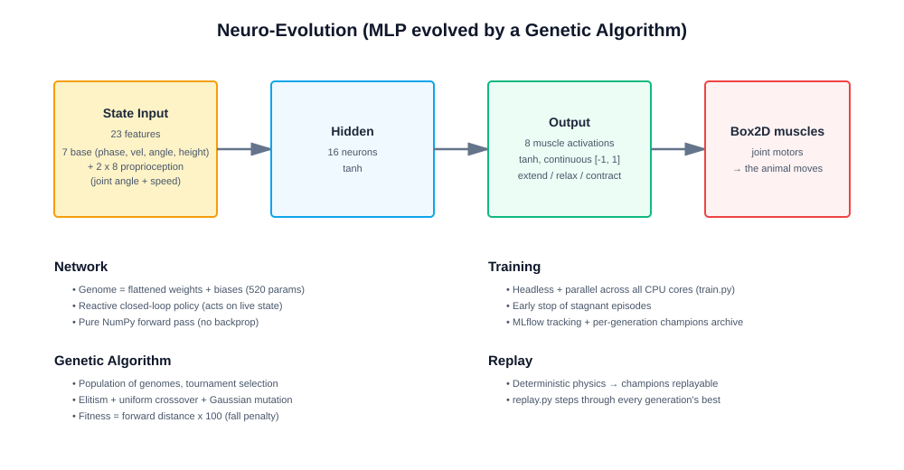

**Key details :**
- Input = 7 base features + 2 per actuated muscle (proprioception), so **23 for the fox**, **19 for the chicken** and **41 for the cat**
- Hidden = 16 (tanh), Output = one activation per muscle (tanh), **8 for the fox**, **6 for the chicken** and **17 for the cat**
- Genome size follows : 520 weights for the fox, 422 for the chicken, **961 for the cat**
- The **alien** is sized for its maximum body instead : **55 → 16 → 24**, and its genome carries 35 morphology genes in front of the 1304 weights
- Fitness = forward distance x 100 (fall penalty), plus a stability bonus for the biped

### PPO (`IA_TYPE = "ppo"`)

A custom PyTorch **actor-critic** trained with the clipped PPO objective :

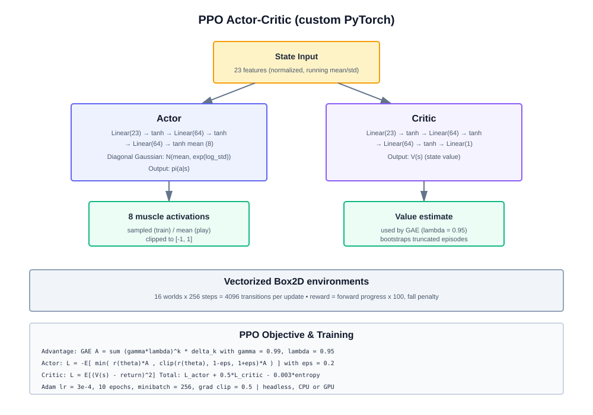

**Training details :**
- γ (gamma) = 0.99, λ (lambda) = 0.95, clip_range = 0.2
- 16 vectorized Box2D envs x 256 steps per update
- Adam lr = 3e-4, entropy coef = 0.003, observation normalization

---

## 📂 Repository structure
```bash
├── assets/                       # Sprites, GIFs, procedural renders, SVG diagrams
│
├── src/
│   ├── config.py                 # Main switches : ANIMAL, IA_TYPE, display
│   │
│   ├── animals/                  # One file per animal (skeleton + procedural skin)
│   │   ├── definition.py         # Dataclasses (bones, muscles, skin spec)
│   │   ├── fox.py                # The fox (quadruped, 8 muscles)
│   │   ├── chicken.py            # The chicken (biped, 6 muscles)
│   │   ├── cat.py                # The cat (4 independent legs + spine, 17 muscles)
│   │   └── alien.py              # The alien (skeleton built from genes, 4 to 8 legs)
│   │
│   ├── core_engine/
│   │   ├── physics.py            # Box2D world, bones, muscles, Quadruped
│   │   ├── procedural_skin.py    # Procedural low-poly renderer
│   │   ├── overlay.py            # Display modes (procedural / skeleton / overlay)
│   │   ├── parallax.py           # Scrolling background
│   │   └── display.py            # Pygame camera & drawing
│   │
│   └── models/
│       ├── ia_base.py            # Common IA interface
│       ├── policy.py             # MLP + input building (shared, lightweight)
│       ├── ia_gen.py             # Neuro-evolution (genetic algorithm)
│       ├── ia_ppo.py             # PPO (custom PyTorch actor-critic)
│       ├── ia_chore.py           # Choreography selection
│       ├── evaluate.py           # Headless episode (used by parallel workers)
│       └── config_*.py           # Pydantic configs per algorithm
│
├── main.py                       # Watch / control an animal (windowed)
├── train.py                      # Headless parallel training (GA or PPO)
├── replay.py                     # Replay the GA champions
├── progress.py                   # Live progress of the current run
│
├── requirements.txt
├── RUNPOD.md                     # How to train on a Runpod CPU pod
├── LICENSE
└── README.md
```

---

## 💻 Run it on Your PC
Clone the repository and install dependencies:
```bash
git clone https://github.com/Thibault-GAREL/Quadruped-AI.git
cd Quadruped-AI

python -m venv .venv # if you don't have a virtual environment
source .venv/bin/activate   # Linux / macOS
.venv\Scripts\activate      # Windows

pip install pygame box2d-py numpy pandas mlflow pydantic pydantic-settings tqdm
# PyTorch is only needed for PPO (pick CPU or your CUDA version) :
pip install torch --index-url https://download.pytorch.org/whl/cpu

python main.py
```

Pick the animal and the algorithm in `src/config.py` :
```python
ANIMAL  = "fox"        # "fox", "chicken", "cat", or "alien" (evolved skeleton)
IA_TYPE = "neuro_ga"   # "neuro_ga", "ppo" or "choreography"
```

### 🕹️ Play & watch (`main.py`)
```bash
python main.py
```
`main.py` opens the Pygame window. What it does depends on `src/config.py` :

  🎮 `HUMAN_CONTROL = True` : drive the animal yourself with the keyboard.

  🤖 `HUMAN_CONTROL = False` + `IA_TYPE = "neuro_ga"` : train the genetic algorithm live in the window.

  🕺 `IA_TYPE = "choreography"` : train the choreography selection live in the window.

⚠️ The choreography search still hardcodes **8 muscles** (`src/models/ia_chore.py`), so it only makes sense on the fox. On the cat it would drive the two front legs and ignore the rest. The neuro-GA and PPO read the muscle count from the animal, they have no such limit.

⚠️ **Do not evolve the alien from this window.** `main.py` builds one body at startup and keeps it, so every individual would be judged on the same default creature (6 legs, all genes at zero) and the morphology would never evolve. Only `train.py` rebuilds the body of each individual from its own genes, which is where the alien belongs. The window is still fine for watching one, `replay.py` rebuilds the champion's body too.

⚠️ `IA_TYPE = "ppo"` is **not** handled by `main.py` and exits with a message pointing you to the right tool. PPO trains headless with vectorized environments (`train.py --algo ppo`), and a trained policy is watched with `replay.py`. Each script has one job : `train.py` trains, `main.py` drives and trains in-window, `replay.py` watches.

In-window keys : `TAB` switch render mode (procedural / skeleton / overlay), `F1` camera follow, `F2` toggle rendering (fast mode), `S` save, `ESC` quit.

### 🏋️ Train headless & in parallel (`train.py`, recommended)
No window, all cores, much faster than the on-screen loop. It **auto-resumes** from the last checkpoint if you relaunch it.
```bash
python train.py --algo ga      # neuro-evolution (genetic algorithm), uses ALL CPU cores
python train.py --algo ppo     # PPO (needs PyTorch), uses your GPU automatically if present
```
Push it to the max (PowerShell, Windows) :
```powershell
# GA : one worker per core + a bigger population (free when you have the cores)
python train.py --algo ga --workers 16
$env:NEURO_GA_POPULATION_SIZE = "128" ; python train.py --algo ga --generations 500

# PPO : pick the device and scale the parallel Box2D worlds
$env:PPO_DEVICE = "cuda" ; python train.py --algo ppo      # "cuda" (GPU), "cpu", or "auto" (default)
$env:PPO_N_ENVS = "32"   ; python train.py --algo ppo --updates 1000
```
⚠️ This project is **CPU-bound** (the Box2D physics runs on the CPU and the networks are tiny). The GA gains **nothing** from a GPU, and even PPO is often just as fast on CPU. Prefer a **many-core CPU** machine (only one GPU is ever used, no multi-GPU). See `RUNPOD.md` for a long training on a **Runpod CPU pod**.

### 🎬 Watch a trained model (`replay.py`)
This is how every GIF above was recorded. It reads **both** algorithms and picks the right one from the file you give it :
```bash
python replay.py       # latest model found, whatever produced it

# Genetic algorithm : the run folder holds one champion per generation
python replay.py outputs/results/neuro-ga_run-22_date-2026-07-31

# PPO : a single trained policy, either its run folder or the .pt directly
python replay.py outputs/models/ppo-fox_run-02_date-2026-08-02
python replay.py outputs/models/fox_ppo.pt

# The cat, its two best runs (GA then PPO)
python replay.py outputs/results/neuro-ga-cat_run-02_date-2026-08-03
python replay.py outputs/models/ppo-cat_run-02_date-2026-08-03/best_model.pt

# The alien, whose body is rebuilt from the champion's own genes
python replay.py outputs/results/neuro-ga-alien_run-03_date-2026-08-05
```
Given a PPO **folder**, `replay.py` picks `best_model.pt`. Point at the `.pt` yourself when you want `last_model.pt` instead (see the warning in the shaped reward section, the better of the two depends on the animal).

Keys : `SPACE` replay from start, `F1` camera follow, `ESC` quit. With the GA you also get `→ / ←` next and previous generation, `↑` jump to the best champion, `HOME / END` first and last generation. PPO has a single final policy, so it has no generation to browse.

Set `ANIMAL` in `src/config.py` to match the animal you trained. If it does not match, `replay.py` tells you which value to use instead of failing on a dimension mismatch.

⚠️ Careful, `outputs/models/{animal}_ppo.pt` is the **rolling** checkpoint, overwritten by every new PPO run. To replay a specific past run, point at its dated folder as shown above.

---

## 📊 Visualize results with MLflow

Launch the UI (from the project root, with a venv that has mlflow):
```powershell
mlflow ui --backend-store-uri sqlite:///mlflow.db
```
Open http://localhost:5000 in your browser.

The cat was trained later and its history came back from the pod in its own file, so it needs a second command :
```powershell
mlflow ui --backend-store-uri sqlite:///mlflow-cat-2026-08-03.db
```
It holds the experiments `quadruped-neuro-ga-cat` and `quadruped-ppo-cat`, which are the runs behind the two cat GIFs above. The alien came back the same way :
```powershell
mlflow ui --backend-store-uri sqlite:///mlflow-alien-2026-08-05.db
```
Experiment `quadruped-neuro-ga-alien`, with both runs in it (the pod one and the local retrain).

**Find the best runs** :
1. Open experiment `quadruped-neuro-ga` (or `quadruped-ppo-fox`)
2. Add the `best_distance_ever` (or `ep_distance_mean` for PPO) metric column
3. Sort descending, the top row is your best run
4. Click any run to see the fitness curve over generations

**Best saved model file** is at:
```
outputs/models/<name>_run-XX_date-YYYY-MM-DD/best_model.pkl   # GA
outputs/models/<animal>_ppo.pt                                # PPO
```

Check progress of the latest run while it is training :
```powershell
python progress.py
```

---

## 📖 Inspiration / Sources
I code it without any help 😆 !

A big thanks to [Robin Konig](https://github.com/RobinKoenig69) for the compute for a big part of the fox and chicken training !

Code created by me 😎, Thibault GAREL - [Github](https://github.com/Thibault-GAREL)
